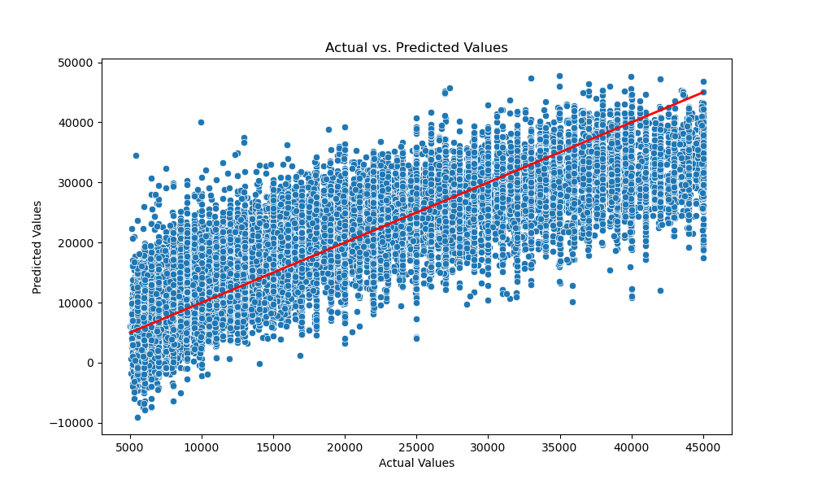

**Business Goal**

The market for Used Cars was valued at USD 195.84 billion in 2021, and it is projected to reach USD 302.47 billion by 2027 - CAGR 7.5%. (Source: https://www.mordorintelligence.com/industry-reports/united-states-used-car-market/market-size). Dealership networks are a critical player in this industry by establishing brand recognition and making used car options viable, primarily for the middle-class population.

The goal of this anlaysis is to determine what factors in a used car are valued by potential buyers which will ultimately determine the price of the used car. This will help used car dealers to deivise strategies to improve the profitability and growth

**Data**

The analysis is using a dataset from kaggle. The original dataset contained information on 3 million used cars. The dataset used for this analysis contains information on 426K cars to ensure speed of processing. Target variable for the analysis is the price of used car

**Modelling & Performance**

In this project, we employed various regression modeling techniques to predict used card prices. The models evaluated include Linear Regression, Ridge Regression, Lasso Regression, and Elastic Net Regression. Each model was trained and evaluated using a train/test split, followed by cross-validation and hyperparameter tuning using GridSearchCV to optimize performance.

Among these, the Ridge Regression model demonstrated the best performance with a Root Mean Squared Error (RMSE) of 5436.4067: and an R-squared (R²) value of 0.7340. That means that the model's prefictions are off by about 5436.4067 units from the actual values of used car prices and approximately 73.4% of the variance in the disease progression is explained by the features in the model.

These metrics indicate that the Lasso Regression model provides a high level of accuracy in predicting used car prices, making it the most suitable model for this dataset. The model's ability to perform feature selection through L2 regularization helped in identifying the most significant predictors, thus enhancing interpretability and relevance.

**Conclusion**

##### Key Findings

| Feature           | Coefficient  | Impact          | Insight                                                                                                   |
|-------------------|--------------|-----------------|-----------------------------------------------------------------------------------------------------------|
| Age               |  -4378.855959 | Strong Negative | older cars are associated with lower used car prices                                                     |
| Odometer          |-3081.794259 | Strong Negative | Cars with higher odometer reading is associated with lower used car prices.                                |
| Fuel Diesel       |  1653.165794  | Postive         | Diesel engine have a higher price (on average 1659$) compared to other engines                           |
| 8 Cylinders       |  1268.208055  | Positive        | Cars with 8 cylinder  have a higher price compared to other engines                                      | 
| Front Wheel Drive | -1142.712257 | Negative        | Cars with front wheel drives have a lower price compared to other types of car                            |

##### Key Reccomendations

- **Low Age & Mileage** : Age & Odometer readings are a critical attributes which drives the price of the used car. Maintaing an inventory with lower age and odometer reading will enable dealdership to charge higher prices for their used car sales
- **Attractiveness** : Consider adding more inventory of cars with features which drive higher pricing - Diesel engines, All/Rear Wheel drives and 8 cylinders. 
- **Incentives** : Dealership should consider designing incentives to drive sales. Consider offerring incentives on cars with front wheel drives
- **Improving profitability** : consider utilizing the model to predict the prize of car before procuring them on a go-forward basis. This will help reduce the cost of inventory and help maximize profitability

